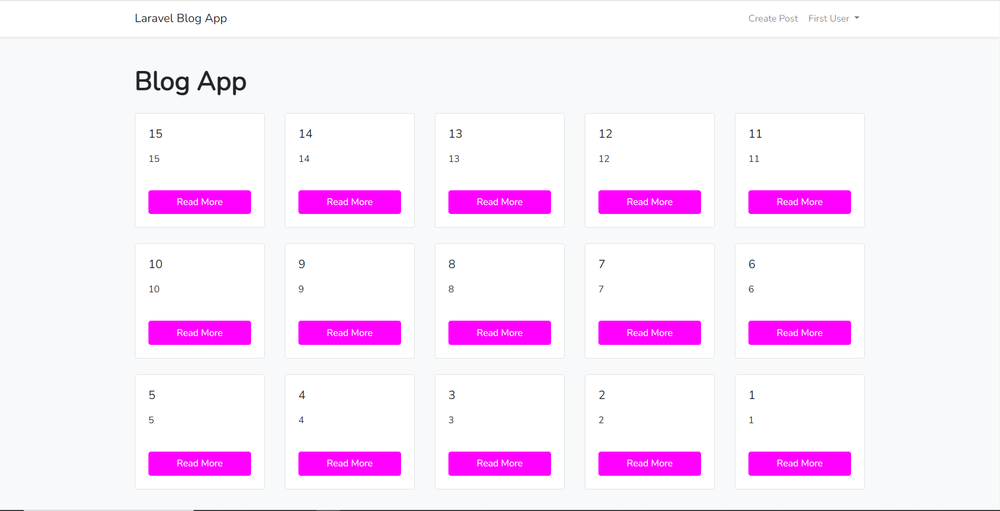

# Projekt Blog
Projekt na IKT, napsaný v PHP pomocí frameworku Laravel.
## První spuštění
Ve složce BlogApp:
- instalace Laravel pomocí `composer install`
- isntalace Bootstrap pomocí `npm install`
- vytvořte MySQL databázi `BlogApp` a importujte obsah databáze ze souboru `initial_data.sql`
- spusťte `npm run dev` pro kompilaci webpacku
- spusťe `php artisan migrate`
- spusťte `php artisan serve`
- na `localhost:8000` uvidíte běžící projekt a vytvořte si nového uživatele 

## Další spuštění
Ve složce BlogApp:
- spusťte `php artisan serve`
- na `localhost:8000` uvidíte běžící projekt a vytvořte si nového uživatele 

## Miimální požadavky
- PHP verze 8.2 
- Laravel verze 11.9
---

---
By Marek Ruttner 2024